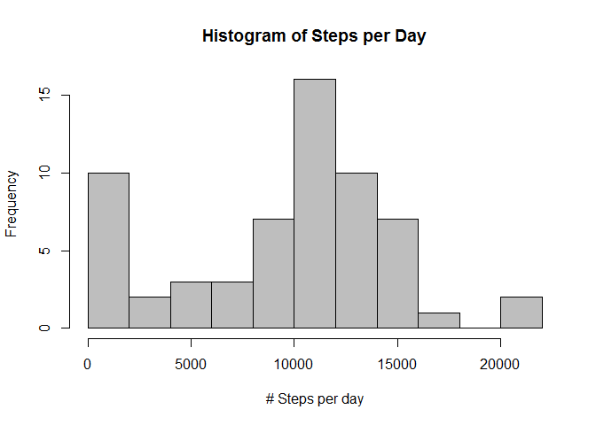
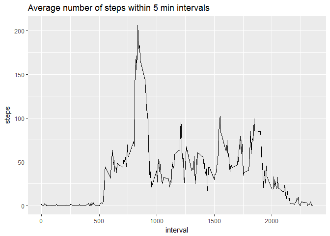
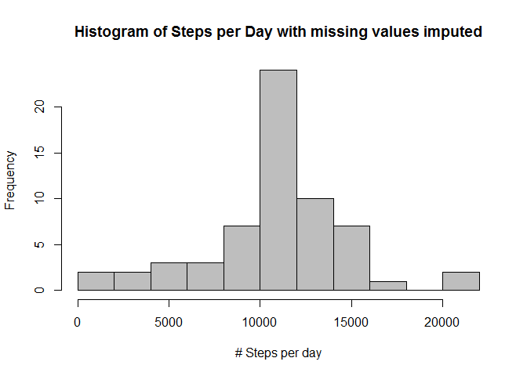
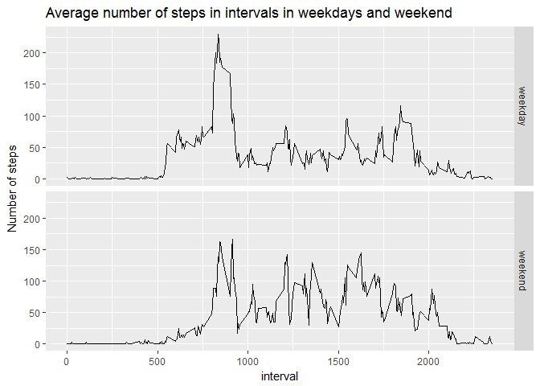

# Activity Analysis
Paweł‚ Dębiec  
23.02.2017  


##Loading and preprocessing the data
Let's start with loading the data file and formating date column into date type


```r
activity <- read.csv("./data/activity.csv", na.strings = "NA")
activity$date <- as.Date(activity$date, "%Y-%m-%d")
```

Let's also load here all the packages to be used later

```r
library(dplyr) 
library(ggplot2)
library(Hmisc)
```


##Mean total number of steps taken per day
Then we calculate the total number of steps made each day and draw a histogram for those.

```r
steps_per_day <- activity %>% group_by(date) %>% summarise(total = sum(steps, na.rm = TRUE))
hist(steps_per_day$total, breaks = 10, col = "grey", xlab= "# Steps per day", main = "Histogram of Steps per Day")
```

<!-- -->


The mean total number of steps is:

```r
mean(steps_per_day$total)
```

```
## [1] 9354.23
```
and the median is:


```r
median(steps_per_day$total)
```

```
## [1] 10395
```
Note that we haven't yet take care of empty values and there are days for which there are no valid observations. 

##Average daily activity pattern
Then we calculate and plot the average number of steps within each 5 minute interval:

```r
steps_per_interval <- activity %>% group_by(interval) %>% summarise(avg = mean(steps, na.rm = TRUE))

ggplot(data= steps_per_interval, aes(interval, avg)) + geom_line() + ggtitle("Average number of steps within 5 min intervals") + ylab("steps")
```

<!-- -->
  
As it is hard to observe in the figure, let's check which exact interval has the biggest  verage steps value:

```r
data.frame(steps_per_interval[which.max(steps_per_interval$avg),])
```

```
##   interval      avg
## 1      835 206.1698
```

##Imputing missing values
As we know there are some observations with NAs (in steps column), let's check how many NAs is there in entire activity dataset


```r
sum(is.na(activity))
```

```
## [1] 2304
```

Let's create a new dataset in which we imput the missing steps values with the mean value for corresponding interval from other days. 

```r
activity.imputed <- data.frame(activity %>% group_by(interval) %>% mutate( steps = impute(steps, mean)))
```

Now let's draw a histogram for total steps by day for this imputed dataset

```r
steps_per_day_imputed <- activity.imputed %>% group_by(date) %>% summarise(total = sum(steps, na.rm = TRUE))
hist(steps_per_day_imputed$total, breaks = 10, col = "grey", xlab= "# Steps per day", main = "Histogram of Steps per Day with missing values imputed")
```

<!-- -->


Let's see how the mean and median changed vs original dataset
The mean total number of steps per day is:

```r
mean(steps_per_day_imputed$total)
```

```
## [1] 10766.19
```
and the median is:


```r
median(steps_per_day_imputed$total)
```

```
## [1] 10766.19
```
As expected both values have raised significantly.


##Activity patterns between weekdays and weekends

Let's enrich the dataset with day of week information. (please note that the names of weekned days are working for Polish locale (plese change to appropriate names for your language))

```r
activity.imputed <- mutate(activity.imputed, weekday = weekdays(date))
activity.imputed <- mutate(activity.imputed, is_weekend = ifelse(weekday %in% c("sobota", "niedziela"), "weekend", "weekday" ))
```

Lets group data by Interval and is_weekend, calculate average steps per interval and plot a time series for weekdays and weekend.

```r
avg_week <- activity.imputed %>% group_by(interval, is_weekend) %>% summarise( avg = mean(steps))

ggplot(avg_week, aes(x=interval, y=avg)) + geom_line() + ylab("Number of steps") + facet_grid(is_weekend ~ .) +
ggtitle("Average number of steps in intervals in weekdays and weekend")
```

<!-- -->


